# Euler

An AI research topic navigator that helps students and early-career researchers move
from a broad interest to a concrete, defensible research topic — and then stress-tests
that idea before any time is spent building it.

It is aimed at the part of research that is hardest to get right and easiest to waste
weeks on: choosing a topic that is novel enough to matter, scoped tightly enough to
finish, and grounded in what has already been published.

---

## The problem it solves

Most research projects fail for predictable reasons, and most of them are visible
*before* anyone writes a line of code or a single equation:

- **Too broad.** A statement like "I want to work on NLP" is not a project — it is
  a field. Without narrowing, the work never has a clear stopping point.
- **Too narrow.** A topic that is already fully solved, or that only reproduces a
  known result, does not lead anywhere interesting or publishable.
- **Reinventing the wheel.** Students regularly start work that closely tracks
  published papers they did not know existed, because there is no easy way to check
  the literature early.
- **Ill-scoped feasibility.** A method that requires three GPUs, a curated dataset
  nobody has, and two years of work is not a good master's project — even if it
  sounds exciting in the abstract.
- **No validation step.** Ideas are often chased all the way to a prototype before
  anyone asks the hard questions: is this actually novel, does the method answer the
  research questions, and can the student pull it off?

Euler exists to catch those problems early, in conversation, with a real literature
search behind it — not from memory, not from a cheerleader, and not after weeks of
work have already been spent.

---

## What Euler is

Euler is an agent with a **stage-gated workflow**. It talks to you one stage at a
time, and each stage must be finished before the next one opens. The point of the
gates is not bureaucracy — it is to make sure the thinking happens in the right order,
with the right information available at each step.

The core promise is simple: by the time you reach the end of the early stages, you
should have a topic you can defend, a short list of the gaps it targets, the closest
prior work you need to cite, and a clear, honest read on whether your proposed
approach is likely to work.

---

## The seven stages

Euler walks through seven stages. The first five are implemented and connected to real
behaviors (arXiv search, mock LLM fixtures, gating). Stages 6–7 have pages and route
shells that are wired to meaningful logic. F5 (Build Coach) action route was added to
complete the F4→F5→F6 chain.

```mermaid
graph LR
    F1["F1 · Topic Selection"]
    F2["F2 · Gap Identification"]
    F3["F3 · Literature Search"]
    F4["F4 · Idea Validation"]
    F5["F5 · Build Coach"]
    F6["F6 · Paper Writing"]
    F7["F7 · Publish"]

    F1 --> F2 --> F3 --> F4 --> F5 --> F6 --> F7

    classDef live fill:#dff0d8,stroke:#3c763d,color:#3c763d
    classDef stub fill:#fcf8e3,stroke:#8a6d3b,color:#8a6d3b

    class F1,F2,F3,F4,F6,F7 live
    class F5 stub
```


### Stage 1 — Topic Selection

You start with a broad domain (for example: "I want to work on continual learning for
language models"). Euler asks a few targeted clarifying questions — about the sub-area
you care about most, the data and hardware you can actually access, and how ambitious
the project should be — and then proposes a short list of specific, scoped candidate
topics. Each candidate comes with a one-line scope, a conservative novelty angle, and ane-line scope, a conservative novelty angle, and a
note on why it fits your background and level.

You pick one. That becomes the locked topic for the rest of the workflow.

### Stage 2 — Gap Identification

Once a topic is locked, Euler maps out what is known and what is not. It produces a
structured list of knowledge gaps: the specific concepts, methods, and evaluations you
would need to understand or use before you can execute the project, along with why each
one matters. This is the bridge between "I have a topic" and "a plan."

### Stage 3 — Literature Search

Euler searches the real arXiv API for relevant papers on the topic and the gaps you
identified. This is a live search, not a fabricated list. The results become part of the
context for the next stage — you cannot honestly assess novelty without knowing what has
already been published.

### Stage 4 — Idea Validation

This is the stage most tools skip. Given your locked topic, your research questions, the
gaps, your background and resources, your proposed methodology, and the papers found in
the literature search, Euler acts as a constructively adversarial reviewer. It attacks
the methodology on five axes:

- **Novelty** — has this exact approach been done? What is the closest prior work? What
  is the actual differentiation?
- **Feasibility** — can *you*, with your stated level and resources, actually execute
  this? What skills or tools are missing?
- **Logic** — does the method actually address the research questions? Are there
  unstated assumptions or gaps?
- **Scope** — is it too broad for the level, or too narrow to matter?
- **Evaluation** — how would you know if it worked?

The output is a structured verdict — `proceed`, `refine`, or `pivot` — with specific
suggestions. You can iterate: refine the methodology and run validation again until the
verdict is `proceed`.

### Stages 5–7 — Build Coach, Paper Writing, Publish

These stages are fully wired and part of the live demo:

- **F5 Build Coach** — chat-based implementation coaching plus experiment logging and stage completion. The demo project has a stored coaching thread and 3 sample experiment logs.
- **F6 Paper Writing** — section-by-section drafting help with reference linking.
- **F7 Publish** — venue recommendations and submission checklist.

Each stage has a UI page and real API routes; the seeded demo project has all seven stages marked COMPLETE with realistic content.

After validation, the natural next steps are helping the user design the actual build,
structure the paper, and prepare for publication. These stages have UI pages and API
route shells in the app today, but they are not yet wired to meaningful logic. They are
part of the roadmap, not the current demo.

---

## What makes it different

- **Stage-gated, not free-form.** Euler does not dump an answer in one turn. It
  sequences the thinking so each question is answered with the right context in hand.
- **Real literature grounding.** The literature stage calls the live arXiv API.
  Novelty checks are based on actual papers, not invented references.
- **Honest, not flattering.** The validation stage is designed to find real flaws — not
  to tell you your idea is great. If the idea is strong, it says so; if it has holes, it
  names them.
- **Demoable without an API key.** Euler has a built-in mock mode, so the workflow can
  be presented and tested without configuring a paid LLM provider. The real LLM is
  optional and only needed for live use.

---

## What is working now

- **F1 Topic Selection** — clarifying questions, candidate proposals, topic locking.
- **F2 Gap Identification** — structured gap list tied to the locked topic.
- **F3 Literature Search** — real arXiv search, keyless, results feed F4.
- **F4 Idea Validation** — adversarial review with a structured verdict.
- **F5 Build Coach** — chat-based implementation coaching plus experiment logging and stage completion.
- **F6 Paper Writing** — generate paper sections from the F4 methodology + F3 papers, identify references from draft text via arXiv, save/edit sections, and complete into a paper draft artifact.
- **F7 Publish** — recommend venues from the draft title/abstract, track a submission checklist, select a venue, and record the submission.
- **Mock mode** — the full early workflow can be run and demonstrated without a live LLM
  key.
- **Contract tests** — key API and agent behavior is covered by automated tests that run
  offline against the mock provider.

## What is still on the roadmap

- **(none at the moment)** — F4–F7 action routes are all wired. Future work is about
  deepening behavior (better prompts, richer artifacts, real LLM integration) rather than
  stubbing endpoints.

---

## Demo script (for the presenter)

1. Start the app in mock mode: `npm run dev`. Open `http://localhost:3000`.
2. On the home page, create a project from a broad domain — for example, "I want to
   work on catastrophic forgetting in small language models."
3. Walk through **F1 Topic Selection**: Euler asks a few clarifying questions and
   proposes 3–5 scoped candidate topics. Pick one.
4. Move to **F2 Gap Identification**: Euler lists the concepts and skills the chosen
   topic depends on, and why each matters.
5. Move to **F3 Literature Search**: Euler searches arXiv and returns relevant papers
   with titles, authors, and years. Point out that these are real results, not invented
   citations.
6. Move to **F4 Idea Validation**: describe a proposed methodology and run the adversarial
   review. Show the structured output — novelty, feasibility, logic, scope, evaluation,
   and a `proceed / refine / pivot` verdict with suggestions.
7. If time allows, refine the methodology and run validation again to show the
   iterate-until-proceed loop.

The same demo can be run against a real LLM by configuring `LLM_BASE_URL`, `LLM_API_KEY`,
and `LLM_MODEL` in `.env`. In mock mode, the responses are deterministic fixtures designed
to illustrate the shape of a real session.

---

## Running it

You can run Euler **two ways** — as a plain website (no Docker needed) or in a
container. Both default to **mock mode** (works offline, no API key, seeded demo
project included). To get real AI conversations, add an optional OpenRouter key.

### Option A — Plain website (no container)

Requires **Node.js 20+**. From the project root:

```bash
npm install

# 1. Create your local env (copy the example — mock mode is the default)
#    On Windows (PowerShell):   copy .env.example .env
#    On Mac/Linux (bash):       cp .env.example .env

# 2. Set up the SQLite database and seed the demo project + Paper Lab session
npx prisma db push
npm run db:seed

# 3. Start the dev server
npm run dev
```

Open **http://localhost:3000**. You'll see the demo research thread
("Federated learning for edge devices", all 7 stages complete) and the demo Paper Lab
session — both protected from deletion. Create a new thread to start a fresh
conversation.

### Option B — Docker container

Requires **Docker Desktop** (or Docker Engine). From the project root:

```bash
# Build & start (mock mode by default — no key needed, seeded automatically)
docker compose up -d --build
```

Open **http://localhost:3000**. The entrypoint runs `prisma db push` + `db:seed`
automatically on every start, so the demo data is always present.

---

### Enabling live AI (both options)

The default is **mock mode**: no key, deterministic responses, works anywhere.

To use real model conversations, set these before starting (via your `.env` for
Option A, or as build-args / container env for Option B):

| Variable        | Example                                |
|-----------------|----------------------------------------|
| `LLM_PROVIDER`  | `openrouter` (or `mock`)               |
| `LLM_BASE_URL`  | `https://openrouter.ai/api/v1`         |
| `LLM_API_KEY`   | `sk-or-v1-...` (never commit this)     |
| `LLM_MODEL`     | `nex-agi/nex-n2.5-pro:free`            |

For Option B:
```bash
LLM_PROVIDER=openrouter LLM_BASE_URL=https://openrouter.ai/api/v1 \
LLM_API_KEY=sk-or-v1-... docker compose up -d --build
```

> ⚠️ **Never commit `.env`.** It is gitignored. The repo and image build keyless/mock only.

---

### Dev commands

- **Run (dev):** `npm run dev` → `http://localhost:3000`
- **Build (prod):** `npm run build`
- **Tests:** `npm run test` (contract tests hit the real arXiv API; unit tests stay offline)
- **Type check:** `npm run typecheck`
- **Database:** `npx prisma db push` then `npm run db:seed` (after first clone / container start)

---

## Project structure (for technical questions)

- `src/app/api/projects/[id]/stages/` — one folder per stage (F1–F4, F6, F7 live;
  F5 has action route + agent + data route, page is wired), each with a page and
  an action/data/chat route.
- `src/lib/harness/agents/` — the system prompts for each stage (F1–F4 today).
- `src/lib/harness/provider/` — LLM provider abstraction with a mock backend used for
  demo and tests.
- `src/lib/harness/tools/` — external tools such as the arXiv search used by F3.
- `src/lib/gating.ts` — stage-gate logic: a stage opens only when the previous one is
  complete (bypassable in test mode).
- `tests/contract/agent.test.ts` — automated contract tests for the agent API and core
  flows.

---

## README status

Rewritten during the winning-build pass (F4 route completion + contract tests). The
README is now presenter-focused: it explains the problem, the workflow, what is live,
what is stubbed, what is on the roadmap, and gives a concrete demo script.